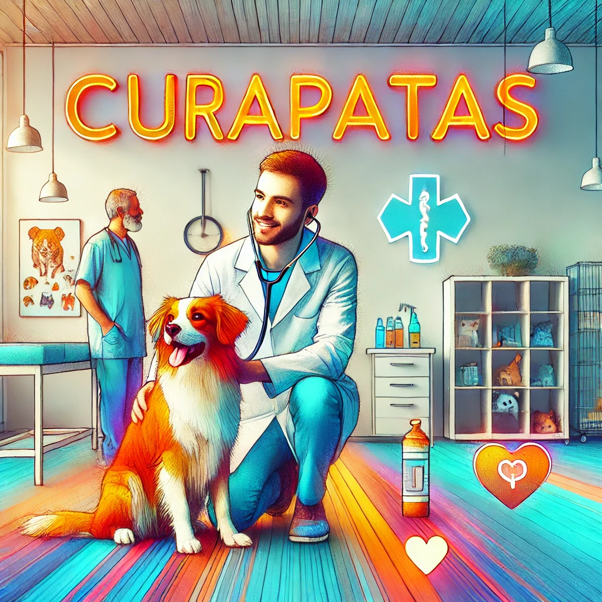

|  | [Backend](./BackEnd/README.md)   |  [FrontEnd](./FrontEnd/README.md) |
|---|---|---|
# CuraPatas

---  

## 🐾 **CuraPatas: Una plataforma para el cuidado de tus mascotas**

### 📝 **Descripción de la funcionalidad principal**

**Registro y Perfiles de Usuarios**

- 👤 **Usuarios**:
    - 🐕 Dueños de mascotas
    - 🩺 Veterinarios
    - ❤️ Voluntarios

- Cada perfil contiene:  
📋 Mascotas registradas  
🛠️ Servicios ofrecidos  
📌 Necesidades específicas

---  

### 🎯 **Justificación de la idea y audiencia objetivo**

💡 **La idea**: Centralizar servicios y recursos para el cuidado de mascotas en una única plataforma.

👥 **Audiencia objetivo**:

- Dueños de mascotas que buscan orientación y servicios.
- Veterinarios interesados en ofrecer sus conocimientos y servicios.
- Voluntarios que deseen ayudar en el bienestar animal.

✨ Lo que hace única a **CuraPatas**:

1. 🌍 **Enfoque global**: Accesible a todos, no limitado a una comunidad específica.
2. 🐾 **Servicios adicionales**: Consultorías, guías personalizadas, y productos específicos.
3. 💖 **Impacto positivo**: Mejorar la calidad de vida de las mascotas y educar a sus dueños.

---  

### 📊 **Análisis de mercado**

🔍 **Referente**: [DataPest](https://www.siacyl.org/public/datapetshelp.aspx).

**Diferencias principales**:

- 🌐 DataPest es limitado geográficamente; CuraPatas tiene alcance global.
- 🔧 Funcionalidades extendidas, como consultorías y marketplace.
- 📚 Información relevante y accesible sobre cuidado, salud y bienestar animal.

---  

### 🌟 **Funcionalidades clave**

#### 🐕 **Gestión de Mascotas**

- 📷 **Registro de mascotas**: Foto, nombre, edad y raza.
- 🩺 **Historial médico**: Accesible para dueños y veterinarios autorizados.
- ⏰ **Recordatorios**: Vacunas y citas médicas.
- 🔍 **Filtros**: Por mascota registrada.
- 🆘 **Mascotas perdidas**: Registro para ayudar en su recuperación.
- 🏡 **Adopción y hogar temporal**: Mascotas buscando familia o refugio temporal.
- 💞 **Parejas para mascotas**: Encuentra compañeros para tus animales.

---  

#### 🛒 **Marketplace de Servicios**

- 💼 Servicios:
    - 🩺 Consultas veterinarias
    - ✂️ Peluqueria
    - 🚶 Paseadores
    - 🚨 Servicios de emergencia
- 🌍 Filtros: Ubicación, precio, calificación, etc.
- 📅 **Reserva de servicios**.
- ⭐ **Calificaciones y comentarios**.

---  

#### 🐾 **Adopción Responsable**

- 🔍 Filtros: Por ubicación, tamaño, raza, etc.
- 📝 Formulario para proceso de adopción.

---  

#### 📖 **Blog Educativo**

- 📚 Artículos: Cuidado, entrenamiento, alimentación y salud.
- 💬 Interacción: Comentarios y preguntas.
- 🎯 Filtros: Por categorías específicas.
- ✏️ **Contribuciones**: Publicaciones por veterinarios.
- ⭐ **Calificación de artículos**.

---  
